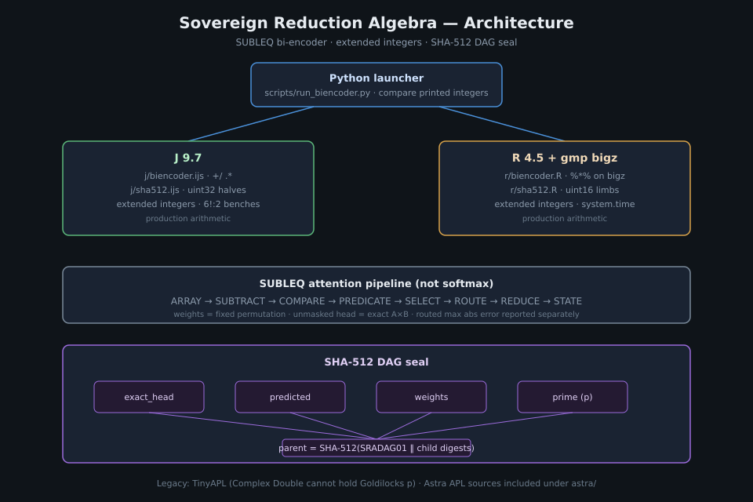

# Sovereign Reduction Algebra

[](LICENSE)
[](https://github.com/AHMADALIPARR/sovereign-reduction-algebra/releases/tag/v1.0.1)
[](https://www.jsoftware.com/)
[](https://www.r-project.org/)
[](https://github.com/AHMADALIPARR/sovereign-reduction-algebra)

Array reduction algebra for an experimental SUBLEQ attention / bi-encoder.
Production arithmetic is **J 9.7** and **R 4.5 with gmp `bigz`**. Python only
launches those processes and compares the integers they print.

This is **not** a trained softmax transformer. Tower weights are a fixed
permutation. The late interaction is subtract → compare → predicate → select →
route → reduce.



## What it does

Two towers apply one fixed permutation. The unmasked attention head must equal
exact integer matrix multiplication. A SUBLEQ-routed prediction is reported
separately; its absolute error is not required to be zero. Both engines seal
the same tensors with a SHA-512 DAG and must agree on the digest.

Goldilocks field modulus:

```
p = 18446744069414584321 = 2^64 − 2^32 + 1
```

held as an extended integer in J and in R. TinyAPL is retained only as a legacy
demo: Complex Double cannot hold `p` (ulp at `2^64` is 4096).

## Quick start

```bash
# Requires jconsole (J 9.7+) and Rscript with the gmp package.
JCONSOLE=/path/to/jconsole python3 scripts/run_biencoder.py
python3 -m unittest tests.test_biencoder
JCONSOLE=/path/to/jconsole python3 scripts/run_benchmarks.py
```

`run_biencoder.py` exits non-zero if the unmasked head disagrees with the
printed reference product, shapes disagree, J and R disagree on the seeded
4×4 case, or the SHA-512 DAG seals differ. Routed max abs error does not fail
the run.

## Seeded 4×4 result

Unmasked exact head (J = R = reference):

```
18 18 12 16
23 22 12 19
19 29 18 29
 6 15 10 15
```

| Metric | Value |
|--------|-------|
| Routed max abs error | 15 |
| Goldilocks `p` | 18446744069414584321 |
| Shared SHA-512 DAG seal | `e6b4a8fda2cde450bd3d9c2b14932136b2894e2b78a1d6c91c52681ec06f3bd7f13e660a655ca84171ccb77584cc0729792c2123ab5b4b758e74576323756f6e` |

Live transcript of a run on this tree: [`docs/demo-transcript.txt`](docs/demo-transcript.txt)
([PNG](docs/images/demo-transcript.png)).

## One integer training step

Not softmax and not a training loop. `scripts/run_train_step.py` launches
`j/train_step.ijs` and `r/train_step.R`. Python only checks that the printed
integers match. `Wq` and `Wk` stay the fixed permutation, so the unmasked head
stays `A` times `B`. The loss is the sum of absolute residuals between the exact
product and the routed prediction. That residual is added once to an integer
projection that starts at zero, then added elementwise to the routed prediction.
The unmasked head is not modified. On seed 20261002 the measured loss stays
74. Folding the projection onto the routed prediction makes the post-step
routed max abs error 0, because the residual is added back and the post
prediction equals the exact product. The exact head still matches `A` times
`B`. An exact-head mismatch after the step fails the run.

Post-step SHA-512 DAG seal (J = R). The weights node is `Wq` stacked over `Wk`
stacked over the projection. The canonical layout is unchanged. The predicted
node is the post-step routed prediction.

```
b12e6f47e74d637223ead6619fd746476164bb4414dc030066e73fa607f301469fd98b5e77bcb79b0cf15cb798086680cad39d721ffccddc2d4922801885ab7a
```

## Measured benchmarks

Source: [`results/benchmarks.json`](results/benchmarks.json) (J N=1024 matmul remeasured 2026-10-03 15:48:00 PT; J N=1024 SHA-512 DAG seal remeasured 512.146054 s, 1 trial; other rows 2026-10-02 23:10:14 PT).
Inputs `A[i;j]=(i·N+j) mod 5`, `B[i;j]=(N·N+i·N+j) mod 5`. Seal times hash
exact=product, predicted=product, 4×4 permutation, and `p`.

### Matmul (seconds)

| Engine | N=128 (3 trials) | N=1024 (3 trials) |
|--------|------------------|-------------------|
| J 9.7 | 0.112684, 0.092637, 0.095784 | 72.315527, 73.415031, 73.807073 |
| R 4.5 / gmp | 0.089, 0.089, 0.090 | 66.719, 68.561, 64.266 |

N=1024 J matmul checksum `4294962175`, result type `64` (printed by the J bench).

### SHA-512 DAG seal (seconds)

| Engine | N=128 (3 trials) | N=1024 |
|--------|------------------|--------|
| J 9.7 | 6.514977, 6.452345, 6.419265 | 512.146054 (1 trial) |
| R 4.5 / gmp | 38.453, 36.978, 38.912 | not run |

Digests:

- N=128 (J = R): `ccafddfba100f51a3856500b009f0644f15d6956e7ecd9667d4e84c4a6a74f7cc60cfe83381f559ff7d28979ebcbc44758f07a7ba86e9a6b682adaee2555a6fc`
- N=1024 (J): `681ec299e447f7c07defe7a09ee8641c6a66fa60d041a1a8dccc5196e7c9fb2aa4238618fc0d098cc8913cf9a878aa29f27d4102cffa2ff2cfa405a3533b89af`

R N=1024 seal was not started; see `not_run` in `results/benchmarks.json`.

Full tables: [`docs/BENCHMARKS.md`](docs/BENCHMARKS.md).

## Layout

```
sovereign-reduction-algebra/
  LICENSE
  README.md
  docs/
    ARCHITECTURE.md   # system map
    BENCHMARKS.md     # measured tables only
    SEAL.md           # SHA-512 DAG byte layout
    ASTRA.md          # astra/*.apl notes
    SPEC.md           # reduction algebra object
    demo-transcript.txt
    images/
  j/                  # production J arithmetic + seal + benches
  r/                  # production R/gmp arithmetic + seal + benches
  astra/              # GNU-APL style registry / routing / mixture (source included)
  tinyapl/            # legacy TinyAPL demos
  reference/          # legacy Python Goldilocks + reduction algebra
  scripts/            # launchers (no numeric authority)
  results/            # measured JSON only
  tests/
  vendor/tinyapl      # TinyAPL 0.12.0.0 Linux binary
```

## Documentation

| Document | Contents |
|----------|----------|
| [Architecture](docs/ARCHITECTURE.md) | Engines, pipeline, verification rules |
| [Benchmarks](docs/BENCHMARKS.md) | Matmul and seal timings from `benchmarks.json` |
| [Seal](docs/SEAL.md) | Node roles `exact_head`, `predicted`, `weights`, `prime`; parent hash of child digests |
| [Astra](docs/ASTRA.md) | APL agent registry, routing, mixture sources |
| [Spec](docs/SPEC.md) | Reduction algebra object `R = (D, OP, E, A, C, S)` |

## SHA-512 DAG seal (summary)

Four child nodes — `exact_head`, `predicted`, `weights`, `prime` — each hashed
as a canonical integer tensor (`SRANOD01` …). The parent preimage is
`SRADAG01` plus the raw child digests in that order. Seal = SHA-512(parent).
J stores SHA-512 words as uint32 halves; R uses uint16 limbs. Details:
[`docs/SEAL.md`](docs/SEAL.md).

## Astra

`astra/*.apl` is GNU-APL style source for an agent registry, budget routing,
and bounded-round mixture. A GNU APL run of that source matched the untrained
J/R SHA-512 DAG seal

```
e6b4a8fda2cde450bd3d9c2b14932136b2894e2b78a1d6c91c52681ec06f3bd7f13e660a655ca84171ccb77584cc0729792c2123ab5b4b758e74576323756f6e
```

`SEAL_MATCH` was 1. A one-cell mutation of the routed prediction changed the
digest (`MUTATED_DIFFERS` 1). The mixture layer is not integer: the same run
still printed floats for the route weights, the route scores, and the mixture
answer. See [`docs/ASTRA.md`](docs/ASTRA.md).

## License

Copyright © 2026 AHMAD ALI PARR. Licensed under the GNU Affero General Public License v3.0. See [LICENSE](LICENSE).
